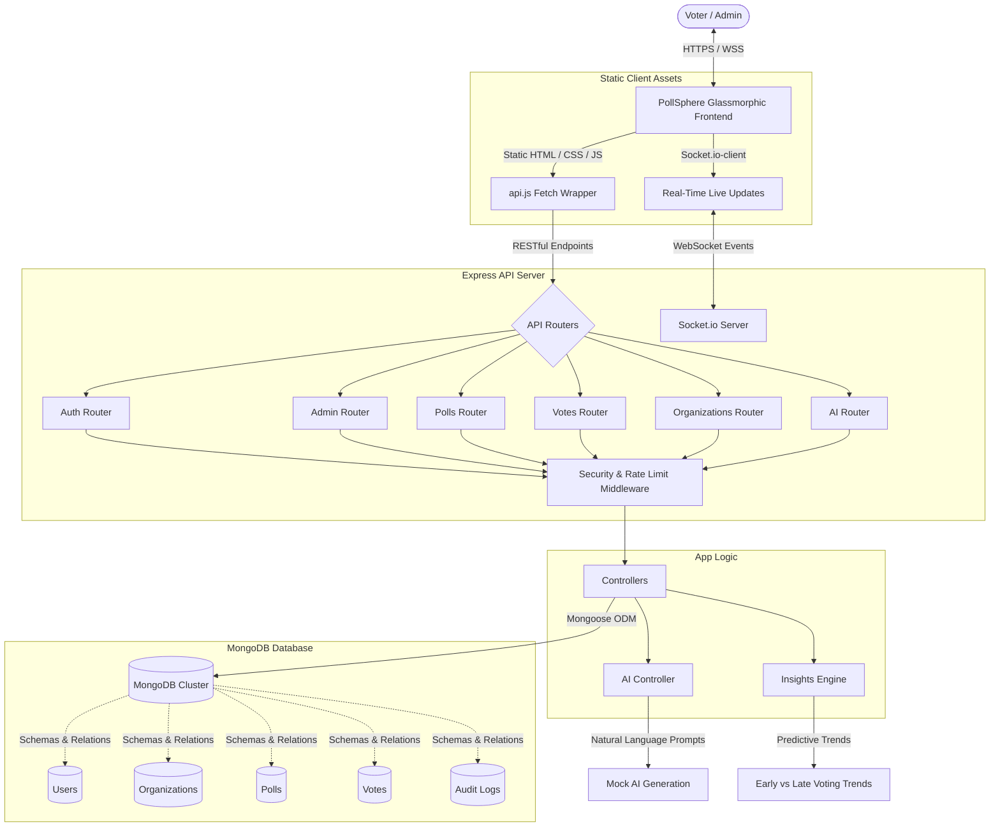

# 🌌 PollSphere — Full-Stack Internal Polling & Workspace Intelligence

PollSphere is a secure, production-hardened, full-stack web application designed for organization-wide polling, collaborative decision-making, and workplace insights. Leveraging a **Glassmorphic Vanilla Frontend** and a robust **Express/Node.js API**, PollSphere features role-based workspace management, real-time live-updating metrics via **Socket.io**, database-enforced vote integrity, and intelligent **AI features** for poll generation and predictive analytics.

---

## 🏗️ System Architecture

PollSphere is organized as a decoupled, deployment-friendly application. The backend serves the high-performance API while seamlessly hosting the static frontend assets or supporting independent, cross-origin static client deployments.



---

## 📁 Project Directory Layout

```
Internal Polling Management System/
├── backend/                 # Node.js & Express API Server
│   ├── Config/              # Configuration files & schema validations
│   ├── Controller/          # Routing controllers (Auth, Admin, Org, Poll, Vote, AI, Insights)
│   ├── Database/            # MongoDB connection configuration
│   ├── Middleware/          # Security (Helmet, CORS), logs (Morgan), and error middlewares
│   ├── Models/              # Database models (User, Poll, Vote, Organization, OrgMember, Audit)
│   ├── Routers/             # Express Router listings
│   ├── Utils/               # Async catch handlers & format response helpers
│   ├── index.js             # Main server startup & Socket.io initialization
│   ├── package.json         # Dependency configuration files
│   └── .env                 # Server secrets & configuration keys (local environment only)
├── frontend/                # Static SPA Client Assets
│   ├── css/                 # Modern styling sheets
│   │   ├── global.css       # Design tokens, variables, base animations, and common shapes
│   │   ├── auth.css         # Glassmorphic user signup, login, and admin registries
│   │   ├── dashboard.css    # Sidebar structures, statistics cards, and scroll bars
│   │   ├── polls.css        # Interactive vote scales and result charts
│   │   └── admin.css        # Admin management tables and AI controllers
│   ├── js/                  # SPA script modules
│   │   ├── api.js           # Unified Fetch wrapper with path detection & interceptors
│   │   ├── common.js        # Dynamic headers, user sessions validation, and toast system
│   │   ├── auth.js          # Switch logic and submit validation routers
│   │   ├── dashboard.js     # Workspace metrics loader and join options
│   │   ├── polls.js         # Room sockets binding, charts render, and click inputs
│   │   ├── organizations.js # Member listings, logs, roles change, and exit routines
│   │   ├── admin-polls.js   # Creation controllers, switches, and AI generative hooks
│   │   └── admin-users.js   # Member approval lists and action updates
│   ├── index.html           # Landing Auth Dashboard page
│   ├── dashboard.html       # Overview of active organizations & statistics
│   ├── polls.html           # Real-time list of active & historic polls
│   ├── organizations.html   # Collaborative team workspace rosters
│   ├── admin-polls.html     # Administrative creation & status toggle portal
│   ├── admin-users.js       # Admin portal to manage platform memberships
│   └── ...                  # Helper layouts (forgot/reset passwords, email verifiers)
└── README.md                # Unified platform developer documentation
```

---

## ✨ Features & Capabilities

### 👥 Workspace Organizations & RBAC
- **Multi-Tenant Workspaces**: Users can create, join, or leave organizations using unique invitation codes (`inviteCode`).
- **Role-Based Access Control (RBAC)**: Supports roles at both the system level (`user`, `admin`, `reviewer`) and the organization level (`admin`, `moderator`, `member`).
- **Registration Acceptance**: Newly registered non-admin profiles must be accepted by an active administrator before gaining platform access.
- **Audit Trails**: Security actions and workspace memberships are tracked inside a dedicated audit log.

### ⚡ Real-Time Live Results (Socket.io)
- **Live Upvotes & Trends**: The API server manages connection channels for active polls.
- **Event Rooms**: When a voter views a poll, their browser joins a Socket room (`poll_${pollId}`).
- **Zero-Refresh Updates**: Voting on a poll broadcasts the updated vote count to all active listeners in real time.

### 🧠 Intelligent AI Features
- **AI Poll Generator**: Admins can specify a natural language prompt to generate polls instantly. The generator utilizes context clues to establish appropriate options (e.g. food options for "lunch", time slots for "meetings", or feature names for "development sprint priorities").
- **Predictive Voting Insights**: High-fidelity analytics extrapolate voting patterns:
  - **Outcome Prediction**: Analyzes current trends and leading choices to predict the likely winner with a dynamic confidence percentage.
  - **Voting Velocity**: Tracks votes cast per hour to determine participation speed.
  - **Behavioral Clustering**: Clusters votes by submission time to identify peak engagement distributions (Morning, Afternoon, Evening).
  - **Momentum Tracking**: Detects whether the voting velocity is increasing or decreasing between early and late sessions.

### 🛡️ Production Security & Hardening
- **Double-Layer Integrity**: Duplicate votes are blocked both at the controller logic layer and the database layer through unique compound indexes.
- **Security Headers**: Standardizes headers using `helmet` and custom `cors` configuration matching allowed environment origins.
- **Rate Limiting**: Employs separate limiters for standard REST routes (`apiLimiter`) and brute-force protection on authentication routes (`authLimiter`).
- **Robust Error Handling**: Centralized logging via `morgan`, standardized schema validation, custom `AppError` utilities, and request middleware.

---

## 🎨 Premium Frontend Design (PollSphere)

The frontend features a high-fidelity visual layout designed to look polished and state-of-the-art:
- **Glassmorphic Cards**: CSS variables customize gradients, subtle backdrops (`backdrop-filter: blur()`), and sleek transparent card boundaries.
- **Dynamic Styling**: Background glow blobs (`blob-1`, `blob-2`) move fluidly, creating an interactive, high-end, contemporary workspace environment.
- **Inter Typography**: Integrates Google's *Inter* typography alongside beautifully structured SVG icons and customized elements.
- **Clean Interactions**: Supports transitions, input focus indicators, micro-animations on form submits, spinner integrations, and non-blocking toast notifications.

### Color Tokens Design System (`frontend/css/global.css`)
```css
:root {
  /* Color Palette (Harmonious HSL) */
  --clr-primary: hsl(262, 80%, 50%);       /* Vibrant Indigo/Purple */
  --clr-primary-light: hsl(262, 80%, 65%);
  --clr-secondary: hsl(190, 90%, 45%);     /* Teal/Aqua highlight */
  --clr-success: hsl(142, 70%, 45%);       /* Clean emerald Green */
  --clr-danger: hsl(350, 80%, 50%);        /* Modern Crimson Red */
  
  /* Layout Transitions & Backdrops */
  --tr-smooth: all 0.3s cubic-bezier(0.4, 0, 0.2, 1);
  --shadow-lg: 0 10px 30px rgba(0, 0, 0, 0.15);
  
  /* Glassmorphism Variables */
  --glass-bg: rgba(255, 255, 255, 0.45);
  --glass-border: rgba(255, 255, 255, 0.25);
}
```

---

## 🗄️ Database Schemas & Relations

PollSphere employs strict Mongoose schemas defining relationships between collections:

### 1. User Schema (`users`)
Tracks registered users, passwords, roles, and administrative statuses.
- `name` (String, required)
- `email` (String, required, unique)
- `password` (String, required, hashed with Bcrypt)
- `role` (String, enum: `['user', 'admin', 'reviewer']`, default: `'user'`)
- `isrRoleAccepted` (Boolean, default: `false`)

### 2. Organization Schema (`organizations`)
Defines independent collaborative workspaces.
- `name` (String, required)
- `description` (String)
- `inviteCode` (String, unique, auto-generated)
- `createdBy` (ObjectId, ref: `user`, required)

### 3. OrgMember Schema (`orgmembers`)
Maps users to organizations with specialized workspace roles.
- `orgId` (ObjectId, ref: `organization`, required)
- `userId` (ObjectId, ref: `user`, required)
- `role` (String, enum: `['admin', 'moderator', 'member']`, default: `'member'`)
- **Index**: Compound unique index `{ orgId: 1, userId: 1 }` to prevent duplicate membership.

### 4. Poll Schema (`polls`)
Stores surveys, descriptions, and current option vote counts.
- `title` (String, required, 3-200 characters)
- `description` (String, max 1000 characters)
- `options` (Array)
  - `optionText` (String, required)
  - `votes` (Number, default: 0)
- `isActive` (Boolean, default: `true`)
- `createdBy` (ObjectId, ref: `user`, required)
- `orgId` (ObjectId, ref: `organization`)

### 5. Vote Schema (`votes`)
Enforces strict voting integrity.
- `pollId` (ObjectId, ref: `poll`, required)
- `userId` (ObjectId, ref: `user`, required)
- `optionId` (ObjectId, required)
- **Index**: Compound unique index `{ pollId: 1, userId: 1 }` to guarantee a single vote per user per poll.

### 6. Audit Schema (`audits`)
Secures the platform through historical trace logs.
- `userId` (ObjectId, ref: `user`, required)
- `orgId` (ObjectId, ref: `organization`)
- `action` (String, required)
- `details` (Mixed)
- `ipAddress` (String)
- `userAgent` (String)

---

## 📡 API Directory & Payload Documentation

### 🔒 Authentication (`/api/v1/auth`)
| Method | Endpoint | Access | Description |
| :--- | :--- | :--- | :--- |
| `POST` | `/register` | Public | Register a new user workspace account |
| `POST` | `/register-admin` | Public | Register an admin (Requires `ADMIN_CODE`) |
| `POST` | `/login` | Public | Authenticate user, receive JWT cookie |
| `GET` | `/logout` | Authenticated | Terminate user session & clear cookies |
| `GET` | `/me` | Authenticated | Retrieve current user profile details |
| `POST` | `/forgot-password` | Public | Request a secure password reset link |
| `POST` | `/reset-password/:token` | Public | Apply password change using verification token |

#### 📝 Sample Auth Payloads

* **User Login (`POST /api/v1/auth/login`)**
  * **Request Body:**
    ```json
    {
      "email": "dhanujavidat@gmail.com",
      "password": "12334"
    }
    ```
  * **Response Body:**
    ```json
    {
      "success": true,
      "message": "Login successful",
      "user": {
        "id": "697e3fb0a31bf92525c579df",
        "name": "dhanu",
        "email": "dhanujavidat@gmail.com",
        "role": "admin",
        "isrRoleAccepted": true
      }
    }
    ```

* **Current User Check (`GET /api/v1/auth/me`)**
  * **Response Body:**
    ```json
    {
      "success": true,
      "user": {
        "_id": "697e3fb0a31bf92525c579df",
        "name": "dhanu",
        "email": "dhanujavidat@gmail.com",
        "role": "admin",
        "isrRoleAccepted": true,
        "createdAt": "2026-01-31T17:45:20.335Z"
      }
    }
    ```

### 🛠️ Admin Management (`/api/v1/admin` & `/api/v1/auth` Admin endpoints)
| Method | Endpoint | Access | Description |
| :--- | :--- | :--- | :--- |
| `POST` | `/api/v1/admin/create-user` | Admin Only | Directly provision a user profile |
| `GET` | `/api/v1/auth/all-users` | Admin Only | Get all workspace users |
| `PUT` | `/api/v1/auth/update-role/:id` | Admin Only | Update system role of a target user |
| `PUT` | `/api/v1/auth/setup-role/:id` | Admin Only | Approve or decline a user's access request |
| `DELETE` | `/api/v1/auth/delete-user/:id` | Admin Only | Delete user profile |

### 📋 Polls (`/api/v1/polls`)
| Method | Endpoint | Access | Description |
| :--- | :--- | :--- | :--- |
| `POST` | `/` | Org Admin/Mod | Create a new poll |
| `GET` | `/` | Admin Only | Retrieve all system polls |
| `GET` | `/active` | Authenticated | Get all active, open polls |
| `GET` | `/recommended` | Authenticated | Get personalized poll recommendations |
| `GET` | `/org/:orgId` | Authenticated | Get all polls for a specific organization |
| `GET` | `/:id` | Authenticated | Get single poll details by ID |
| `GET` | `/:id/results` | Authenticated | Fetch active voting scores and metrics |
| `GET` | `/:id/insights` | Admin/Mod | Query AI-based predictive analytics & user behavior insights |
| `PUT` | `/:id` | Org Admin/Mod | Edit an existing poll's content |
| `PUT` | `/:id/toggle` | Org Admin/Mod | Close or reopen an active poll |
| `DELETE` | `/:id` | Org Admin/Mod | Permanently delete a poll |

#### 📝 Sample Polls Payloads

* **Create Poll (`POST /api/v1/polls/`)**
  * **Request Body:**
    ```json
    {
      "title": "Favorite Food",
      "description": "Vote for your favorite food",
      "options": ["Pizza", "Burger", "Wraps", "Frankies"]
    }
    ```
  * **Response Body:**
    ```json
    {
      "success": true,
      "message": "Poll created successfully",
      "poll": {
        "_id": "697e2d0a78825cefbdb5f2a3",
        "title": "Favorite Food",
        "description": "Vote for your favorite food",
        "options": [
          { "optionText": "Pizza", "votes": 0, "_id": "697e2d0a78825cefbdb5f2a4" },
          { "optionText": "Burger", "votes": 0, "_id": "697e2d0a78825cefbdb5f2a5" },
          { "optionText": "Wraps", "votes": 0, "_id": "697e2d0a78825cefbdb5f2a6" },
          { "optionText": "Frankies", "votes": 0, "_id": "697e2d0a78825cefbdb5f2a7" }
        ],
        "isActive": true,
        "createdBy": "697e3fb0a31bf92525c579df"
      }
    }
    ```

* **Get Poll Results (`GET /api/v1/polls/:id/results`)**
  * **Response Body:**
    ```json
    {
      "success": true,
      "poll": {
        "id": "697e277615131278f9feac06",
        "title": "Favorite Programming Language"
      },
      "results": [
        { "optionText": "JavaScript", "votes": 10 },
        { "optionText": "Python", "votes": 15 }
      ],
      "totalVotes": 25
    }
    ```

* **Query AI Voting Insights (`GET /api/v1/polls/:id/insights`)**
  * **Response Body:**
    ```json
    {
      "success": true,
      "insights": {
        "prediction": {
          "likelyWinner": "Python",
          "confidence": "60.00%",
          "message": "Based on current trends, \"Python\" is likely to win."
        },
        "trends": {
          "momentum": "Increasing",
          "participationVelocity": "12.50 votes/hour"
        },
        "userBehavior": {
          "peakTime": "Afternoon",
          "distribution": { "morning": 5, "afternoon": 15, "evening": 5 }
        }
      }
    }
    ```

### 🗳️ Votes (`/api/v1/votes`)
| Method | Endpoint | Access | Description |
| :--- | :--- | :--- | :--- |
| `POST` | `/` | Authenticated | Cast a single vote |
| `GET` | `/my-votes` | Authenticated | Get voter's individual voting history |
| `GET` | `/status/:pollId`| Authenticated | Check if user has voted in a poll |
| `GET` | `/poll/:pollId` | Admin Only | List all details of votes cast in a poll |

#### 📝 Sample Votes Payloads

* **Cast a Vote (`POST /api/v1/votes/`)**
  * **Request Body:**
    ```json
    {
      "pollId": "697e277615131278f9feac06",
      "optionId": "697e277615131278f9feac08"
    }
    ```
  * **Response Body:**
    ```json
    {
      "success": true,
      "message": "Vote cast successfully",
      "vote": {
        "_id": "697e284515131278f9feac21",
        "pollId": "697e277615131278f9feac06",
        "userId": "697e3fb0a31bf92525c579df",
        "optionId": "697e277615131278f9feac08",
        "createdAt": "2026-01-31T16:05:25.097Z"
      }
    }
    ```

* **My Voting History (`GET /api/v1/votes/my-votes`)**
  * **Response Body:**
    ```json
    {
      "success": true,
      "count": 1,
      "votes": [
        {
          "voteId": "697e284515131278f9feac21",
          "pollId": "697e277615131278f9feac06",
          "pollTitle": "Favorite Programming Language",
          "optionText": "Python",
          "votedAt": "2026-01-31T16:05:25.097Z"
        }
      ]
    }
    ```

### 🏢 Organizations (`/api/v1/organizations`)
| Method | Endpoint | Access | Description |
| :--- | :--- | :--- | :--- |
| `POST` | `/` | Admin Only | Provision a new organization |
| `POST` | `/join` | Authenticated | Join workspace via `inviteCode` |
| `GET` | `/my` | Authenticated | Fetch organizations the user belongs to |
| `GET` | `/:orgId/members` | Authenticated | Get directory of organization members |
| `GET` | `/:orgId/logs` | Org Admin | Fetch workspace audit logs |
| `PUT` | `/:orgId/members/:userId/role` | Org Admin | Update member workspace role |
| `DELETE` | `/:orgId/leave` | Authenticated | Depart an organization |

### 🤖 AI Utilities (`/api/v1/ai`)
| Method | Endpoint | Access | Description |
| :--- | :--- | :--- | :--- |
| `POST` | `/generate-poll` | Admin Only | Generate contextual questions & options from text prompt |

---

## 🚀 Getting Started & Local Setup

### 📋 Prerequisites
- **Node.js** (v18+ recommended)
- **MongoDB** (Local instance running on `mongodb://127.0.0.1:27017` or MongoDB Atlas URI)

### ⚙️ Step 1: Backend Setup
1. Navigate to the backend folder:
   ```bash
   cd backend
   ```
2. Install the platform dependencies:
   ```bash
   npm install
   ```
3. Create a `.env` configuration file inside `backend/` and configure environment parameters (see **Environment Configuration** below).
4. Run in development mode with automatic hot-reloads:
   ```bash
   npm run dev
   ```
   Or start in standard production mode:
   ```bash
   npm start
   ```

The backend server defaults to port `8080` (unless configured otherwise in your environment settings).

### 🌐 Step 2: Serving the Frontend
The frontend interface is constructed utilizing client-side script modules. Choose one of the following methods to host the assets:

#### Option A: Embedded Host (Recommended)
The Express API serves the static assets directly out of `frontend/` relative to the root URL `/`.
- Navigate to `http://localhost:8080` in your web browser. All Fetch integrations resolve seamlessly without needing cross-origin CORS configurations.

#### Option B: Live Server or Local Static Daemon
Open the project root directory inside your code editor (e.g. VS Code) and run the `Live Server` plugin on `frontend/index.html`.
- Typically launches the web client at `http://127.0.0.1:5500` or `http://localhost:5500`.
- **Note**: Ensure that the local live URL matches allowed entries inside `CORS_ORIGINS` configured on your backend `.env` variables list.

#### Option C: Production Staging
Deploy the `frontend` sub-directory onto Vercel, Netlify, or static S3 hosting.
- Specify target backend pathways at load time by defining `window.APP_CONFIG = { apiBase: 'https://your-api-domain.com/api/v1' }` inside your initializers, or override local settings under `api_base_override` inside browser `localStorage`.

---

## 🔑 Environment Configuration

Create a file named `backend/.env` containing the following schemas:

```env
# Server Network Settings
PORT=8080
NODE_ENV=development

# Database Connection
MONGO_URI=mongodb://127.0.0.1:27017/pollsphere

# Security Credentials
JWT_SECRET=your_super_secret_jwt_signing_key_32_characters
ADMIN_CODE=your_secret_admin_code_for_admin_registration

# CORS & Origin Controls
FRONTEND_URL=http://localhost:8080
CORS_ORIGINS=http://localhost:5500,http://127.0.0.1:5500,http://localhost:3000

# Email SMTP Settings (For Reset Password)
EMAIL_USER=your_smtp_email@gmail.com
EMAIL_PASS=your_smtp_app_password
```

---

## 📈 Next Actionable Checklist
- [ ] **Rate Limiting Hardening**: Refine window parameters and max limits based on API metrics in staging.
- [ ] **CI/CD Pipeline Integration**: Add GitHub Actions workflow to run ESLint, code-check compilers (`node --check index.js`), and automate deploy hooks.
- [ ] **Comprehensive Test Suites**: Implement unit tests (Jest/Supertest) targeting core vote constraints, authentication routes, and workspace creations.
- [ ] **Real AI Engine Hookup**: Transition the Mock AI Controller to use direct SDK connections with Google Gemini API (`@google/generative-ai`) or OpenAI.
- [ ] **Frontend Compilation**: Upgrade to a modern bundle structure (e.g. Vite with TypeScript) for further scaling.

---
*Created with ❤️ by Dhanuja and the PollSphere Development Team.*

